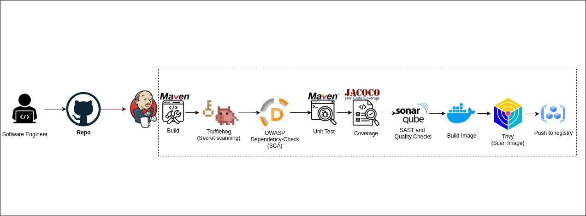

# Pipeline project

## Continuous Integration (CI)

> Pipeline implemented using Jenkins
- Built using maven
- Checking for secrets using trufflehog
- Software Composition Analysis: OWASP dependency check
- SAST: SonarQube
- Containerization: Docker
- Image scanning: Trivy